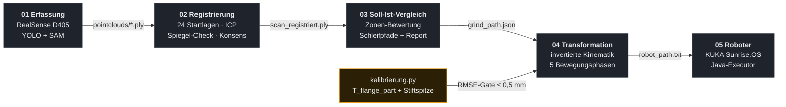
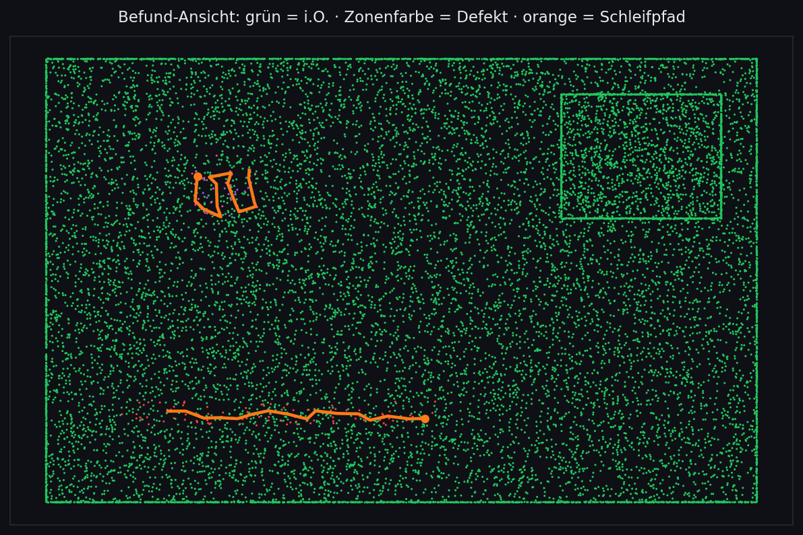

# Automatisierte Qualitätskontrolle & Markierung von Gussteilen

<p>


</p>

**Interdisziplinäres Projekt an der Hochschule Niederrhein** in
Kooperation mit einem Industriepartner: Gussteile automatisch scannen,
mit dem CAD vergleichen und fehlerhafte Stellen (Angussreste, Grate)
direkt am Bauteil markieren — als Vorarbeit für die manuelle
Nacharbeit.

<p align="center"></p>

## Die Idee: umgekehrte Rollenverteilung

Statt Kamera und Werkzeug zum Bauteil zu bewegen, hält der Roboter das
**Bauteil** und führt es an den ortsfesten Geräten vorbei — der
Markierstift „zeichnet", während der KUKA das Teil bewegt. Das spart
Werkzeugwechsel, und die Schleif-Animation im Befund-Report zeigt genau
dieses Prinzip.

<p align="center"></p>

## Datenfluss



## Der Befund-Report

Stufe 3 öffnet nach jedem Lauf automatisch einen interaktiven
3D-Report im Browser: **grün = innerhalb der Toleranz**, Defekte
leuchten in ihrer Zonenfarbe, orange die geplanten Schleifpfade —
inklusive Antasten per Klick und der Schleif-Animation mit festem
Stift und bewegtem Bauteil.

<p align="center"></p>

## Repo-Struktur

```
├── 01_erfassung/          capture.py                       Scannen (D405 + YOLO/SAM)
├── 02_registrierung/      align_to_cad.py                  Scans passgenau aufs CAD
├── 03_soll_ist_vergleich/ cad_compare.py + 5 Module        Befund, Pfade, Report
├── 04_transformation/     kalibrierung.py · bahnplanung.py Roboterbahn + Sicherheits-Gate
├── 05_roboter/            MarkierungExecutor.java          Ausführung auf dem KUKA
├── config/Zonen.json      Prüfzonen mit Toleranzen
└── docs/                  Animationen & Vorschau für dieses README
```

## Schnellstart

**Stufe 3 — Soll-Ist-Vergleich** (braucht die Projektdaten
`Bauteil.stl`, `merged10.ply`, `Bauteil_Zones.json` neben den Skripten,
Pfade in `konfig.py`):

```bash
pip install numpy scipy open3d
cd 03_soll_ist_vergleich && python cad_compare.py     # Report öffnet sich selbst
```

**Stufe 4 — komplett ohne Roboter und ohne Scandaten ausführbar**, mit
den beiliegenden Projektergebnissen:

```bash
cd 04_transformation
python punkte_vorschlagen.py --demo    # Würfel-Demo: findet alle 8 Ecken
python kalibrierung.py                 # rechnet UNSERE 4 Messungen durch → Gate greift
python bahnplanung.py                  # erzeugt robot_path.txt (Luftlauf, 41 Posen)
```

Das Ergebnis entspricht exakt der eingecheckten
`05_roboter/robot_path.txt`.

## Die fünf Stufen im Detail

<details>
<summary><b>01 · Erfassung</b> — Bauteil freistellen und scannen</summary>

Die RealSense D405 liefert Tiefenbilder; YOLO findet das Bauteil, SAM
schneidet es pixelgenau frei. Median über mehrere Frames gegen
Tiefenrauschen, Ausgabe als Punktwolken in `pointclouds/`.
Benötigt das trainierte Modell `best.pt` und die Kamera-Hardware.
</details>

<details>
<summary><b>02 · Registrierung</b> — jeden Scan passgenau aufs CAD legen</summary>

24 PCA-Startlagen, Spiegel-Kontrolle, Grob-zu-fein-ICP und ein
FPFH-RANSAC-Konsens mit Anker vereinen die Einzelscans zu
`scan_registriert.ply` (Meter). Typischer Restabstand zum CAD im
Projekt: deutlich unter 0,5 mm.
</details>

<details>
<summary><b>03 · Soll-Ist-Vergleich</b> — Befund, Schleifpfade, Report</summary>

Signierter Abstand jedes Scanpunkts zur CAD-Oberfläche (+ = Material zu
viel), laterale Zonen-Zuordnung mit Auffangzone „Standard", bestanden =
größte Abweichung ≤ Toleranz. Aus den Defekten entstehen Wegpunkte mit
Flächennormalen: **Grate als Mittellinie, Angüsse als
Serpenten-Raster** — und die Strategie „planvoll statt reaktiv":
Striche werden an Normalen-Kippungen und der Bauteil-Trennebene
seitenweise geteilt, die Reihenfolge nach kleinster
Normalen-Verdrehung optimiert. Der Gewinn wird gemessen und landet als
`reorientation_deg` im `grind_path.json`. Sechs Module, Einstieg
`cad_compare.py`.
</details>

<details>
<summary><b>04 · Transformation</b> — Kalibrierung, invertierte Kinematik, Sicherheits-Gate</summary>

`kalibrierung.py` bestimmt aus Antastmessungen gleichzeitig, wie das
Bauteil im Greifer sitzt und wo die Stiftspitze steht — mit
Plausibilitätsprüfung gegen Doppelmessungen und verrutschte Teile.
`bahnplanung.py` übersetzt die Wegpunkte in Flanschposen
(TRANSFER → APPROACH → INFEED → CONTACT → RETRACT). Bei RMSE > 0,5 mm
oder < 6 Punkten greift das Gate: `NUR_LUFTLAUF=1`. Die beiliegenden
Dateien sind unsere echten Projektergebnisse — Details im
[README des Ordners](04_transformation/README.md).
</details>

<details>
<summary><b>05 · Roboter</b> — Ausführung auf dem KUKA</summary>

`MarkierungExecutor.java` (Sunrise.OS 1.14, Java 1.6) liest
`robot_path.txt` als Classpath-Ressource: erste Pose PTP, dann LIN mit
Phasengeschwindigkeit, Einzelschritt-Bestätigung und Warn-Dialog bei
Luftlauf. Die eingecheckte Bahn ist unser dokumentierter Stand
(41 Posen, `NUR_LUFTLAUF=1`).
</details>

## Ehrliche Bilanz

Die Stufen 1–3 laufen durchgehend und stabil. Stufe 4 scheiterte im
Projektzeitraum an der **Kalibrierqualität**: nur 4 statt ≥ 6
Antastpunkte, RMSE 0,85 mm statt ≤ 0,5 mm — dazu stand die Stiftachse
noch auf dem Platzhalterwert, was am Roboter Achslimit-Fehler
auslöste. Das eingebaute Sicherheits-Gate hat dadurch genau das getan,
wofür es da ist: Es verhinderte Kontaktfahrten mit falscher
Kalibrierung, und der validierte **Luftlauf** (alle Kontaktposen exakt
15 mm vor der Spitze, per Rückrechnung geprüft) ist als
`robot_path.txt` dokumentiert.

**Bekannte Grenzen** (bewusst einfach gehalten, im Code dokumentiert):
Die Grat-Mittellinie nutzt die PCA-Hauptachse und würde stark gebogene
Einzelregionen falsch verdichten; das Anguss-Raster überspringt leere
Zellen ohne Abheben; die Trennebene fürs seitenweise Abarbeiten ist
bauteilspezifisch konfiguriert.

## Hardware & Voraussetzungen

KUKA LBR iiwa (Sunrise.OS) · WSG50-Greifer mit Permanentmagnet ·
Intel RealSense D405 (ortsfest) · Edding-Stift in gefedertem Halter
(ortsfest).

```bash
pip install numpy scipy              # Stufe 4
pip install open3d                   # Stufen 2–3
pip install opencv-python pyrealsense2 torch ultralytics   # Stufe 1
```

Stufe 5 benötigt KUKA Sunrise Workbench 1.14 (Java 1.6).

---
*Interdisziplinäres Projekt · Hochschule Niederrhein · in Kooperation
mit einem Industriepartner*
