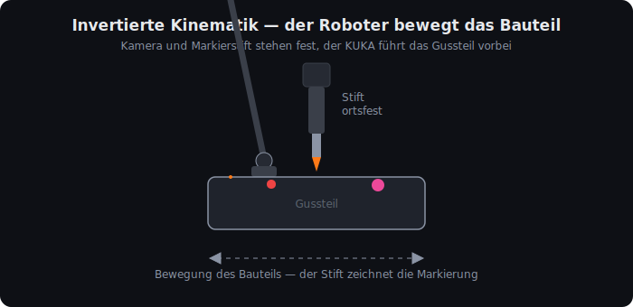
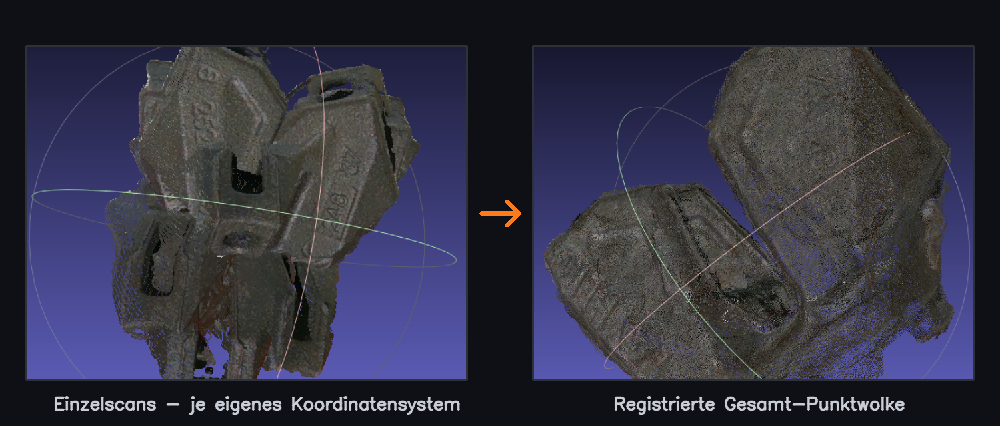
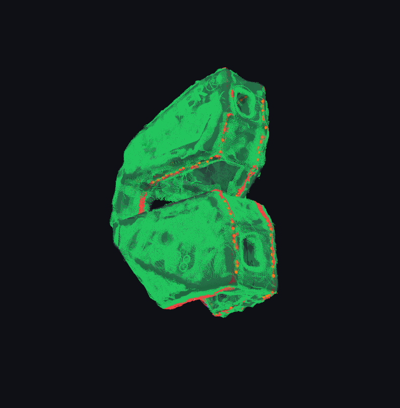
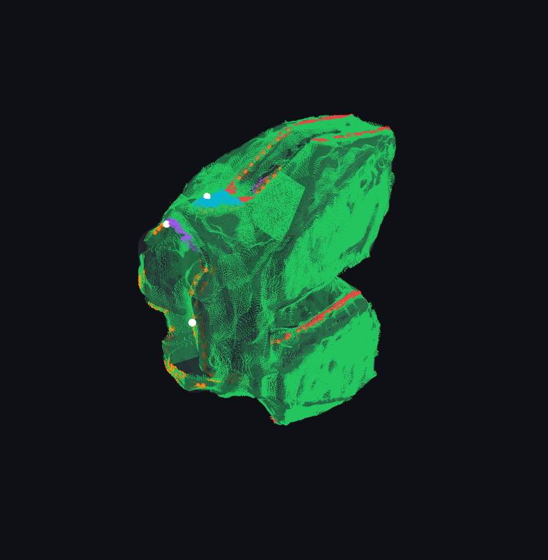

# SegBot — Automatische Fehlererkennung & Markierung von Gussteilen

<p>


</p>

Interdisziplinäres Projekt der **Hochschule Niederrhein** mit der
**Longo GmbH**. Heute bearbeiten die Roboter bei Longo Gussteile mit
fest programmierten Bahnen: Jedes Teil bekommt dieselbe Bahn — egal, ob
und wo Übermaß sitzt. SegBot änder dies: ** Scannen -> Fehlerstellen
erkennen -> individuelle Bearbeitung.**

<p align="center"></p>

##  Invertierte Kinematik

Nicht das Werkzeug fährt zum Bauteil — der Roboter hält das **Bauteil**
und führt es an Kamera und Markierstift.

<p align="center"></p>

## Datenfluss

Fünf Stufen, jede Ausgabe ist die Eingabe der nächsten:

<p align="center"></p>

## Der Scanablauf

Der Roboter dreht das Gussteil vor der ortsfesten Kamera — YOLO findet
das Teil live im Bild, jede Pose wird zur Teil-Punktwolke.

<p align="center"></p>
<p align="center"><sub><a href="docs/Scan_vid.mp4">Volle Qualität: docs/Scan_vid.mp4</a></sub></p>

## Vom Einzelscan zum Gesamtmodell

Jeder Scan bringt sein eigenes Koordinatensystem mit. Die Registrierung
richtet alle grob über die Hauptachsen aus (PCA) und zieht sie per ICP
millimetergenau aufs CAD — übrig bleibt eine deckungsgleiche
Gesamt-Punktwolke.

<p align="center"></p>

## Der Befund-Report

Nach jedem Lauf öffnet sich der interaktive 3D-Report von selbst:
**grün = in Toleranz**, Defekte leuchten in ihrer Zonenfarbe, orange
die geplanten Markierpfade — samt Antasten per Klick und der
Schleif-Animation mit festem Stift und bewegtem Bauteil.

<p align="center">


</p>
<p align="center"><sub>Links Gratbefunde entlang der Kanten — rechts Zonenfarben und die weißen Antastpunkte der Klick-Funktion.</sub></p>

## Repo-Struktur

```
├── 01_erfassung/          capture.py                        Scannen (D405 + YOLO/SAM)
├── 02_registrierung/      align_to_cad.py                   Einzelscans → Gesamtmodell
├── 03_soll_ist_vergleich/ cad_compare.py + 5 Module         Befund, Pfade, Report
├── 04_transformation/     kalibrierung.py · bahnplanung.py  CAD-Punkte → Flanschposen
├── 05_roboter/            MarkierungExecutor.java           Ausführung auf dem KUKA
├── config/Zonen.json      Prüfzonen mit Toleranzen
└── docs/                  Animationen, Bilder, Video
```

## Schnellstart

> [!TIP]
> **Stufe 4 läuft sofort** — ohne Roboter und ohne Scandaten, mit den
> beiliegenden Projektergebnissen:

```bash
cd 04_transformation
python kalibrierung.py       # rechnet unsere 4 Antastmessungen durch
python bahnplanung.py        # erzeugt robot_path.txt (41 Posen)
```

Stufe 3 braucht die Projektdaten (`Bauteil.stl`, `merged10.ply`,
`Bauteil_Zones.json`, Pfade in `konfig.py`):

```bash
pip install numpy scipy open3d
cd 03_soll_ist_vergleich && python cad_compare.py   # Report öffnet sich selbst
```

## So arbeitet der Code

<details>
<summary><b>01 · Erfassung</b> — <code>capture.py</code></summary>

Live-Schleife: Die D405 liefert Farb- und Tiefenbild, **YOLO** setzt die
Box um das Bauteil, **SAM** schneidet es pixelgenau frei. Die Maske
wird auf das Tiefenbild gelegt, ein **Median über mehrere Frames**
dämpft das Sensorrauschen, dann wird die maskierte Tiefe in eine
Punktwolke (Meter) umgerechnet. Jede Aufnahme speichert Punktwolke,
RGB, Tiefe und Metadaten mit fortlaufendem Index.

<p align="center"></p>
</details>

<details>
<summary><b>02 · Registrierung</b> — <code>align_to_cad.py</code></summary>

Pro Scan: **24 PCA-Startlagen** (alle Hauptachsen-Kombinationen) werden
per ICP von grob nach fein eingepasst; eine **Spiegel-Kontrolle**
verhindert, dass ein Scan „falsch herum" perfekt zu passen scheint.
Danach werden alle Scans per **FPFH-RANSAC gegen einen Anker-Scan** in
Konsens gebracht und in einem gemeinsamen Feinzug mit
Flächennormalen verdichtet. Ergebnis: `scan_registriert.ply`,
Restabstand zum CAD im Projekt deutlich unter 0,5 mm.-> Durchlaufzeit beträgt 10 Sekunden
</details>

<details>
<summary><b>03 · Soll-Ist-Vergleich</b> — <code>cad_compare.py</code> + Module</summary>

`analyse.py`: Eine Raycasting-Szene auf dem CAD-Mesh liefert je
Scanpunkt den **signierten Abstand** (+ = Material zu viel), den
Fußpunkt auf der Oberfläche und die **Außennormale**. Punkte werden
**lateral** ihrer Zone zugeordnet (Auffangzone „Standard" für den
Rest); bestanden heißt: größte Abweichung ≤ Toleranz.

`pfadplanung.py`: DBSCAN gruppiert die übertoleranten Punkte je Zone.
Grate werden zur **Mittellinie** verdichtet (Binning entlang der
Hauptachse), Angüsse zum **Serpentinen-Raster** in der Tangentialebene.
`split_regions_by_side` teilt Striche an starken Normalen-Kippungen
und der Bauteil-Trennebene; `optimize_grind_order` sortiert die
Regionen nach kleinster Normalen-Verdrehung — der Gewinn wird in Grad
gemessen und landet im `grind_path.json`. Minimert umsetzen !

`ausgaben.py`: eingefärbte Punktwolke, CSV-Log, `grind_path.json`
(CAD-mm, Normalen, optimierte Reihenfolge) und der Report samt lokalem
Server, der ihn automatisch im Browser öffnet.
</details>

<details>
<summary><b>04 · Transformation</b> — <code>kalibrierung.py</code> · <code>bahnplanung.py</code></summary>

**Kalibrierung:** Für jede Antastung gilt
`T_wf · T_fp · q = Spitze` — daraus schätzt `least_squares`
gleichzeitig die Bauteillage im Greifer (`T_fp`) und die Stiftspitze.
Eine Plausibilitätsprüfung nutzt den Starrkörper: Bei gleicher
Flanschorientierung muss der Flanschabstand dem CAD-Abstand
entsprechen — das fängt Doppelmessungen und ein verrutschtes Teil.

**Bahnplanung:** Jeder Wegpunkt `p` mit Normale `n` wird über zwei
Bedingungen zur Flanschpose:

```
T_wb · p  =  Spitze + Anpressweg · Achse        (Punkt liegt am Stift)
R_wb · n  =  −Achse                             (Fläche senkrecht zum Stift)
T_wf      =  T_wb · T_fp⁻¹
```

Dazu die Phasen TRANSFER → APPROACH → INFEED → CONTACT → RETRACT, ein
Zylinder-Kollisionscheck des Stifthalters (axiale Lage und radialer
Abstand getrennt) und die Reichweitenprüfung. Ausgabe:
`robot_path.txt` mit Geschwindigkeit je Phase im Dateikopf.
</details>

<details>
<summary><b>05 · Roboter</b> — <code>MarkierungExecutor.java</code></summary>

Liest `robot_path.txt` als Classpath-Ressource: Kopfzeilen werden zur
Konfiguration (u. a. `V_CONTACT`), jede Zeile `PHASE;X;Y;Z;A;B;C` zu
einem KUKA-`Frame` (Grad → Radiant). Erste Pose per PTP mit
reduzierter Geschwindigkeit, danach LIN mit der Phasengeschwindigkeit —
standardmäßig mit Einzelschritt-Bestätigung je Pose.
</details>

## Projektstand

> [!NOTE]
> Die Stufen 1–3 laufen durchgehend und stabil. Stufe 4 rechnet mit
> unserer letzten Kalibrierung (**4 Antastpunkte, RMSE 0,85 mm**);  
> Roboter erreicht teilweise sein Achslimit.
> Alle Kontaktposen der berechneten Bahn
> sind per Rückrechnung auf Mikrometer geprüft — die nächsten Schritte
> für einen Neuaufbau stehen im
> [README von Stufe 4](04_transformation/README.md).

Bekannte, bewusst akzeptierte Grenzen (im Code dokumentiert)

## Hardware & Voraussetzungen

KUKA LBR iiwa (Sunrise.OS) · WSG50 mit Permanentmagnet ·
Intel RealSense D405 (ortsfest) · Edding in gefedertem Halter (ortsfest)

```bash
pip install numpy scipy                                    # Stufe 4
pip install open3d                                         # Stufen 2–3
pip install opencv-python pyrealsense2 torch ultralytics   # Stufe 1
```

Stufe 5: KUKA Sunrise Workbench 1.14 (Java 1.6).

---
<p align="center"><sub>Interdisziplinäres Projekt · Hochschule Niederrhein · in Kooperation mit der Longo GmbH</sub></p>
